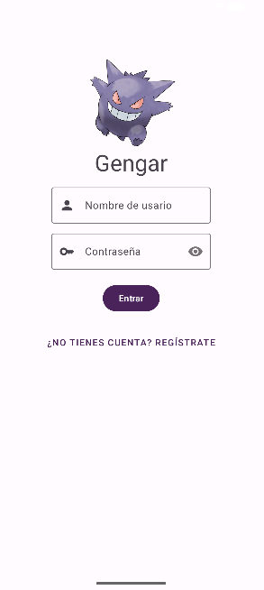
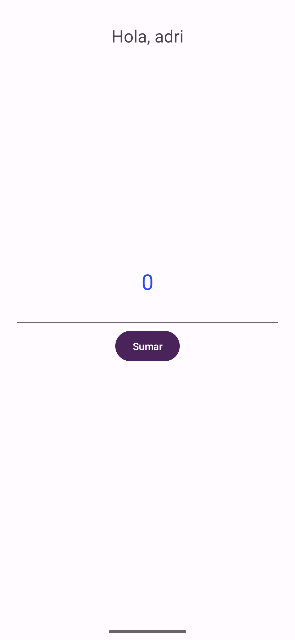

# Gengar App

## Descripción

Gengar es una sencilla aplicación de Android que demuestra un flujo de autenticación de usuario completo, incluyendo registro, inicio de sesión y una pantalla principal personalizada.

## Características

*   **Splash Screen:** Una pantalla de bienvenida que se muestra al iniciar la aplicación.
*   **Registro de Usuario:**
    *   Formulario para registrar nuevos usuarios con nombre de usuario, email y contraseña.
    *   Validación de campos para asegurar que los datos son correctos (email válido, contraseñas coincidentes, campos no vacíos).
    *   La contraseña se guarda de forma segura utilizando un hasheo **SHA-256**.
*   **Inicio de Sesión (Login):**
    *   Formulario para que los usuarios existentes inicien sesión.
    *   Los datos se almacenan y se leen desde `SharedPreferences`.
    *   La contraseña introducida se hashea para compararla con la versión almacenada, asegurando que nunca se comparen en texto plano.
*   **Pantalla Principal:**
    *   Muestra un saludo de bienvenida personalizado con el nombre del usuario que ha iniciado sesión.
    *   Incluye una funcionalidad de contador simple.

## Estilo y Tema

La aplicación utiliza un tema personalizado inspirado en el Pokémon **Gengar**. El estilo busca ser moderno y limpio, utilizando una paleta de colores basada en tonos morados que recuerdan al personaje.

*   **Colores principales:** Se utilizan tonos de morado claro para los fondos y degradados, creando una atmósfera suave y agradable.
*   **Iconografía:** El icono de la aplicación y las imágenes internas utilizan la figura de Gengar para reforzar la temática.

## Capturas de Pantalla

*(Aquí puedes añadir capturas de pantalla de la aplicación para ilustrar su funcionamiento)*

-   *Captura de la Splash Screen*
- 
-   *Captura de la pantalla de Login*
- 
-   *Captura de la pantalla de Registro*
- 
-   *Captura de la pantalla Principal con el saludo*
- 
